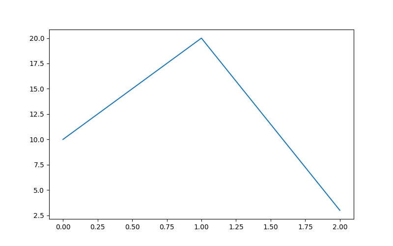

```{r setup, echo=FALSE, cache=FALSE,warning=FALSE,message=FALSE}
library(knitr)
library(rmdformats)
library(Wu)
opts_chunk$set(echo=TRUE,
               cache=FALSE,
               eval=TRUE,
               cache=FALSE,
               prompt=FALSE,
               results="asis",
               tidy=FALSE,
               comment=NA,
               message=FALSE,
               warning=FALSE,
               out.width = '80%')
eval_fast <- TRUE
eval_slow <- FALSE
```


# [Back to Index](index.html)

# Insert image in R rmarkdown
 
 
 ````
 
 ````




# ggplot
## Add annotation with special symbols

 * Add text on a ggplot graph with a special symbol
 * With newline and variables

```{r}
library(ggplot2)
library(data.table)
dt <- data.table(var_x = 1:10, var_y= (1:10) ^ 2)
value_rho = as.character(0.77)
text <- expression("Spearman's" ~ rho ~ "= 0.77")
text <- bquote(atop("Top Line", "Spearman's" ~ rho ~ "=" ~ .(value_rho)))
ggplot(data = dt, mapping = aes(x = var_x, y = var_y)) +
    geom_point(size = 2, alpha = (1:10) / 10) +
    annotate("text", x = 2, y = 80, label = text)

```


## Pass Column Names to ggplot inside a function

 * sym() function turns text into a symbol, like as.name() or as.symbol
 * !! function is to unquote a symbol
 * Use color from a column in a data frame, use scal_color_identity to deactivate legend by colour

```{r}
library(data.table)
library(ggplot2)
dt <- data.table(A=1:10
               , B=1:10
               , C=rep(1:5, each=2)
               , sex=factor(rep(c("M", "F"), each=5))
                 )

clrs <- c("#FF0000", "#00FF00")
dt[["varcolor"]] <- clrs[as.numeric(dt$sex)]

plt <- function(x, y, group){
    x <- sym(x)
    y <- sym(y)
    ggplot(dt, aes(x=!!x, y=!!y)) +
        geom_point() +
        facet_wrap(as.formula(paste0("~", group)), nrow = 1)
}

plt("A", "B", "sex")


ggplot(dt, aes(A, B, colour=varcolor)) + geom_point() +
    scale_colour_identity()

ggplot(dt, aes(x=C, group=sex, colour=varcolor, fill=varcolor)) +
    geom_bar() + scale_colour_identity() + scale_fill_identity()

```

## Stacked Bar Charts by Count


```{r,eval=FALSE}
library(data.table)
dt <- data.table(
    day = sample(1:14, size = 1400, replace = TRUE)
  , state = sample(c("Good", "Bad"), size = 1400, replace = TRUE)
)

p <- ggplot(dt, aes(day)) +
    geom_bar() +
    geom_bar(aes(fill = state))
p

```
## Stacked Bar Charts by Percentage


```{r}
library(data.table)
dt <- data.table(
    day = sample(1:14, size = 1400, replace = TRUE)
  , state = sample(c("Good", "Bad"), size = 1400, replace = TRUE)
  , group = sample(c("I", "II", "III"), size = 1400, replace = TRUE)
)

p <- ggplot(dt, aes(x = day, fill = state)) +
    geom_bar(position = "fill") +
    facet_wrap( ~ group, ncol = 3)
p

```


## Violin Plot

```{r}
library(data.table)
library(ggplot2)

set.seed(123456)
dt <- data.table(
    group = rep(c("A", "B", "C"), each = 300)
  , sex = sample(c("F", "M"), size = 900, replace = TRUE)
  , value = rnorm(900)
)

ggplot(dt, aes(y = value, x = group)) +
  geom_violin(trim=TRUE) +
  geom_boxplot(width=.1) +
  xlab("Group") + ylab("Value")


font_tick_size <- 10
font_axis_size_x <- 20
font_axis_size <- 15

ggplot(dt, aes(y = value, x=sex)) +
    geom_violin(trim=TRUE) +
    geom_boxplot(width=0.1) +
  facet_grid(cols=vars(group)) +
  ## scale_y_continuous(trans="log", breaks=brks) +
  labs(y = "Value", x = "Sex") +
        ## scale_y_continuous(breaks = seq(0,4,1), limits = c(-0.2,4), expand = c(0, 0)) +
        ## scale_x_continuous(breaks = seq(0,200,50), limits = c(-10,220), expand = c(0, 0)) +
  theme(axis.text.x = element_text(size = font_tick_size)
      , axis.text.y = element_text(size = font_tick_size)
      , axis.title.x = element_text(size = font_axis_size_x)
      , axis.title.y = element_text(size = font_axis_size)
     ## ,  plot.margin = unit(plot_margin, "cm")
       , axis.line = element_line(colour = "grey")
         ## , axis.ticks = element_blank()
         ## , panel.grid.major = element_line(colour = "#DDDDDD", size = 0.1)
           ## , panel.grid.minor = element_blank()
      , panel.background = element_blank()
      , strip.background =element_rect(fill="#FFFFFF")
        , strip.text.x = element_text(size = font_axis_size)
        ) +
    annotate("text", y=2.86,x=1.5, label="p(KW) < 0.0001")


## p <- ggplot(dt, aes(y = relative, x=sex)) +
##     geom_violin(trim=TRUE) +
##     facet_grid(rows=vars(area), cols=vars(age_group))

## p <- ggplot(dt, aes(y = relative, x=sex)) +
##     geom_violin(trim=TRUE) +
##     scale_y_continuous(trans="log", breaks=c(0.01, 0.02, 0.04, 0.08, 0.16, 0.32, 0.64, 1.28, 2.56)) +
##     facet_grid(rows=vars(area), cols=vars(age_group)) +
##     labs(y="log transformed relative")

```

## Forest Plot

```{r}


dt <- data.table(
    name=factor(LETTERS[1:8], levels=LETTERS[1:8], ordered=TRUE)
  , coef_value=1:8
  , coef_value_lower=(1:8) - 0.5
  , coef_value_upper=(1:8) + 0.5
)

dt <- dt[, name_label := factor(paste0(name, "  ", "CI"))]
dt <- dt[, num_rep := 22 - nchar(round(coef_value, 4)) ]


p <- ggplot(dt
          , aes(y = name_label
              , x = coef_value
              , xmin = coef_value_lower
              , xmax = coef_value_upper
                )) +
    geom_vline(xintercept=1, color='grey', linetype='dashed',size=0.7) +
    geom_errorbarh(height=0.2,color="#333333",size=0.8) +
    geom_point(color = "#666666", size=2, shape=15) +
    scale_x_continuous(limits=c(0,9)
                     , breaks=c(0,1,2,5, 9)
                     , name='Odds Ratio') +
    ## p <- p + scale_y_discrete(labels = "Y AXIS", sec.axis = dup.axis())
    ylab("") +
    theme_bw() +
    theme(axis.ticks = element_blank()
        , panel.grid.major = element_blank()
        , panel.grid.minor = element_blank()
          ) +
    coord_cartesian(xlim=c(0, 9))
p

## png(file="forestplot.png", width = 2400, height = 1200, res = 300)
## p
## dev.off()


```


## Forest Plot with Annotation

```{r}

clrs <- c("#2EAEE6"
        ## , "#2EE6CA"
        ## , "#2EE677"
        , "#37E62E"
        ## , "#8AE62E"
        ## , "#DCE62E"
        ## , "#E69C2E"
        ## , "#E6492E"
          , "#aaaaaa"
          )
## clrs <- rev(clrs)

font_tick_size <- 10
font_axis_size_x <- 20
font_axis_size <- 10
font_size_annotate <- font_axis_size / .pt

dt <- data.table(
    name = (3:1)
  , name_color = clrs
  , coef_value = c(-1, -2, -3) / 10
  , coef_value_lower = (c(-1, -2, -3) - 0.5) / 10
  , coef_value_upper = (c(-1, -2, -3)+ 0.5) / 10
)

dt <- dt[, name_label := factor(paste0(name, "  ", "CI"))]
dt <- dt[, num_rep := 22 - nchar(round(coef_value, 4)) ]


tit1 <- as.expression(bquote(atop(bold('Active Arm Weighted')
                                  , ~'-0.3 (-0.25, -0.35)')))
tit2 <- as.expression(bquote(atop(bold('Active Arm')
                                  , ~'-0.2 (-0.15, -0.25)')))
tit3 <- as.expression(bquote(atop(bold('Comparator')
                                  , ~'-0.1 (-0.05, -0.15)')))


p <- ggplot(dt
          , aes(x = name
              , y = coef_value
              , ymin = coef_value_lower
              , ymax = coef_value_upper
                )) +
    geom_bar(aes(fill = name_label)
          ,  show.legend = FALSE
          , stat = "identity"
          , just = 0.5
          , size = .9) +
    geom_errorbar(aes(ymin=coef_value_lower, ymax=coef_value_upper)
                , size = 1
                , width = .05
                , color = "#333333"
                  ) +
    scale_fill_manual(values = clrs) + 
    geom_segment(aes(x = 1, xend = 3, y = -0.4, yend = -0.4)
               , color = "black"
               , size = 0.2) +
    geom_segment(aes(x = 1, xend = 1, y = -0.4, yend = -0.385)
               , color = "black"
               , size = 0.2) +
    geom_segment(aes(x = 3, xend = 3, y = -0.4, yend = -0.385)
               , color = "black"
               , size = 0.2) +
    annotate("text", x = 2, y = -0.42
           , label = "p < 0.001"
           , size = font_size_annotate
             , fontface = "italic") + 
    ## geom_segment(aes(x = 0, xend = 0, y = -0.5, yend = 0)
    ##            , color = "black"
    ##            , size = 1) +
    scale_x_continuous(expand = c(0, 0)
                     , limits = c(0.4, 4.2)
                     , breaks = c(1, 2, 3)
                     , labels = c(tit1
                                , tit2
                                , tit3)
                     , position = "top") +
    scale_y_continuous(expand = c(0, 0)
                     , limits=c(-0.5, 0)
                     , breaks = seq(-0.5, 0, .1)
                     , labels = c("-50%", "-40%", "-30%", "-20%", "-10%", "0")
                     , name='Mean') +
    ylab("") +
    xlab("") + 
    theme_bw() +
    theme(axis.ticks.x = element_blank()
        , axis.text.x = element_text(hjust = 0.5
                                   , vjust = 0
                                   , size = font_axis_size
                                   , family = "TT Arial"
                                     ## , face = "bold"
                                     )
        , axis.text.y = element_text(hjust = 0.5
                                   , vjust = 0
                                   , size = font_axis_size
                                   , family = "TT Arial")
        , axis.title.y = element_text(size = font_axis_size
                                    , family = "Times New Roman"
                                    , face = "bold")
        , panel.grid.major = element_blank()
        , panel.grid.minor = element_blank()
        , panel.border = element_blank()
        , axis.line.y = element_line(color="black", size = 0.5)
          ) +
    coord_cartesian(xlim=c(0, 4.5))
p


## png(file="forestplot.png", width = 2400, height = 1200, res = 300)
## p
## dev.off()


```


## Export Plot

```{r, eval = FALSE}
png(file = "filname.png", width = 2400, height = 1200, res = 300)

p
dev.off()

```

## Forest Plot Log Scale


```{r,eval=FALSE}


png(file="forestplot_irf.png", width = 2400, height = 1200, res = 300)
p <- ggplot(dt
          , aes(y = name_label
              , x = coef_value
              , xmin = coef_value_lower
              , xmax = coef_value_upper
                ))
p <- p + geom_vline(xintercept=1, color='grey', linetype='dashed',size=0.7)
p <- p + geom_errorbarh(height=0.2,color="#333333",size=0.8)
p <- p + geom_point(color = "#666666",size=1,shape=15)

p <- p + scale_x_continuous(limits=c(0.1,4), breaks=c(0.1, 0.2, 0.5,1,2,3, 4), name='Adjusted Odds Ratio (IPR)')
## p <- p + scale_y_discrete(labels = "Y AXIS", sec.axis = dup.axis())
p <- p + ylab("")
p <- p + theme_bw()
p <- p + theme(axis.ticks = element_blank()
              , panel.grid.major = element_blank(),
               panel.grid.minor = element_blank()
               )
p <- p + coord_cartesian(xlim=c(0, 4)) +  coord_trans(x="log")
p
dev.off()


include_graphics("forestplot_irf.png")


```


## Arrows

```{r}
dt <- data.table(
    id = 1:20
  , y = sample(1:20, size = 20, replace = TRUE)
  , yend = sample(1:20, size = 20, replace = TRUE)
)
dt <- dt[yend > y]

ggplot(data = dt) +
    geom_segment(
        aes(x = id, y = y, xend = id, yend = yend)
      , data = dt
      , arrow = arrow(length = unit(0.02, "npc"))
      , size = 1.5
      , color = "#666666"
    ) +
    xlab("ID") +
    ## scale_x_continuous(breaks = seq(0, 120, 12)) +
    ylab("Size") +
    ## scale_fill_manual(values = Colors) +
    ## scale_y_log10() +
    ## annotation_logticks() +
    ## coord_cartesian(xlim = c(-90, 900)) +
    theme(legend.position = "none", axis.ticks = element_blank())


```

## Arrows with Direction


```{r}
r <- 1
Arrow_Angle <- 18
Arrow_Length <- 0.2
Line_Size <- 1.0
Legend_Text_Size <- 20
Legend_Title_Size <- 20
Axis_Title_Size_x <- 20
Axis_Title_Size_y <- 20
Plot_Margin <- c(0.5,0.5,0.5,.5)

n <- 50
dp <- data.table(
    x = sample(1:10, size = n, replace = TRUE)
  , xend = sample(1:10, size = n, replace = TRUE)
  , id = 1:n
  , group = factor(sample(c("A", "B", "C"), size = n, replace = TRUE))
)

label(dp$group) <- "Group"

p <- ggplot(dp)
p <- p + geom_segment(aes(
  x = x
  , xend = xend
  , y = id
  , yend = id
  , colour = as.factor(group))
  , arrow = arrow(angle = Arrow_Angle
                  , ends = "last"
                  , length = unit(Arrow_Length, "inches")
                  , type = "closed")
  ,size = Line_Size
)
p <- p + labs(x = "Scale"
              ,y="ID"
              ,title="")
p <- p + scale_x_continuous(breaks=seq(from=1,to=10,by=1))
p <- p + scale_y_continuous(breaks=seq(from=0, to=50,by=10))
p <- p + scale_color_manual(name="Group"
                            , values = c("#e13d14"
                                         ## ,"#c69817"
                                         ,"#84cc33"
                                         ## ,"#37ad7e"
                                         ,"#0190b6")
                            , labels = c('A'
                                         ,'B'
                                         ,'C'
                                         )
                            , guide = guide_legend(
                              title.position = "top"
                              ,nrow=3, byrow = FALSE))
# p <- p + theme_bw()
# p <- P + guides(fill=guide_legend(nrow=2,byrow=TRUE))
p <- p + theme(legend.position = "top"
               , plot.margin=unit(Plot_Margin,"cm")
               , legend.text=element_text(size=Legend_Text_Size)
               , legend.title = element_text(size=Legend_Title_Size)
               , axis.title.x = element_text(size = Axis_Title_Size_x)
               , axis.title.y = element_text(size = Axis_Title_Size_y)
               )
p_a <- p
p

library(ggpubr)
ggarrange(p
          , p
          , labels = c("Figure 1a", "Figure 1b")
          , font.label = list(size = 25)
          , ncol = 2
          , nrow = 1
          , widths = c(1,1))

```


## Cell Plot

 * Plot discrete daily progression states

```{r}
library(ggplot2)

dt <- data.table(
    id=1:10
  , day=rep(1:28, each=10)
  , state=sample(c("A", "B", "C", "D", "E", NA), 28 * 10, replace = TRUE)
)

dt <- dt[, state := factor(state, levels=c("A", "B", "C", "D", "E"), ordered = TRUE)]


clrs <- c("#2EAEE6"
        ## , "#2EE6CA"
        ## , "#2EE677"
        , "#37E62E"
        ## , "#8AE62E"
        , "#DCE62E"
        , "#E69C2E"
        , "#E6492E"
          ## , "#aaaaaa"
          )


ggplot(dt, aes(x=day, y=id)) +
    geom_tile(aes(fill=state, height=(1)), size=1) +
    scale_y_discrete() +
    scale_fill_manual(values = clrs)

linecolor <- "#999999"

ggplot(dt, aes(y=id,x=day)) +
    geom_point(aes(fill=state), colour="transparent", shape=22, size=4) +
    scale_fill_manual(values = clrs)+
    geom_line(aes(group = id), colour=linecolor, alpha=0.5) +
    scale_x_continuous(breaks=c(7, 14, 21, 28)) +
    scale_y_continuous(breaks=c(1, 3, 5, 7, 9)) +
    labs(title = "Title. \n Discrete Time Plot", x="Day", y="ID") +
    geom_vline(xintercept=c(7, 14), colour=linecolor,linetype="dashed") +
    geom_vline(xintercept=21,colour=linecolor,linetype="dashed") +
    theme(panel.background = element_rect(fill = "transparent")
        , plot.background = element_rect(fill = "transparent", color = NA)
        , panel.grid.major = element_blank()
        , panel.grid.minor = element_blank()
        , legend.background = element_rect(fill = "transparent")
        , legend.box.background = element_rect(fill = "transparent")
        , legend.position = 'top'
        , plot.margin=unit(c(1,2,1,2),"cm")
          ) +
    coord_fixed(ratio = 3 / 2
              , xlim = c(0.5, 28.5)
              , ylim = c(0.5, 10.5)
              , expand = FALSE) +
    guides(fill = guide_legend(nrow = 1))


```

## Progression Bar Plot

```{r}
rm(list=ls())
library(ggplot2)
library(data.table)
dt <- data.table(
    id=rep(1:100, each=28)
  , day=rep(1:28, 100)
  , state=sample(c("A", "B", "C", "D", "E"), 28 * 100, replace = TRUE)
    , treatment=rep(c("Case", "Control"), each=28 * 100 / 2)
)

dt <- dt[, state := factor(state, levels=c("A", "B", "C", "D", "E"), ordered = TRUE)]


clrs <- c("#2EAEE6"
        ## , "#2EE6CA"
        ## , "#2EE677"
        , "#37E62E"
        ## , "#8AE62E"
        , "#DCE62E"
        , "#E69C2E"
        , "#E6492E"
          ## , "#aaaaaa"
          )


ggplot(dt, aes(x = factor(day), fill = state)) + geom_bar(position = "fill") +
    facet_wrap(~treatment) + scale_fill_manual(values = clrs) +
    xlab("Day State by Treatment") +
    ylab("Proportions")


ggplot(dt, aes(x=day, fill = state)) + geom_bar() +
    facet_wrap(~treatment) + scale_fill_manual(values = clrs) +
    labs(x="Day State by Treatment"
       , y="Count"
       , title="Progression by Treatment"
         ) +
    scale_x_continuous(breaks=c(7, 14, 21, 28)) +
    scale_y_continuous(breaks=c(10, 20, 30, 40, 50)) +
    theme(panel.background = element_rect(fill = "transparent")
        , plot.background = element_rect(fill = "transparent", color = NA)
        , panel.grid.major = element_blank()
        , panel.grid.minor = element_blank()
        , legend.background = element_rect(fill = "transparent")
        , legend.box.background = element_rect(fill = "transparent")
        , legend.position = 'top'
        , plot.margin=unit(c(1,2,1,2),"cm")
          ) +
    coord_fixed(ratio = 3 / 2
              ## , xlim = c(0.5, 28.5)
              ## , ylim = c(0.5, 10.5)
              , expand = FALSE) +
    guides(fill = guide_legend(nrow = 1))


ggplot(dt, aes(x = factor(treatment), fill = state)) + geom_bar() +
    facet_wrap(~factor(day), nrow=1) + scale_fill_manual(values = clrs) +
    labs(x="Day State by Treatment"
       , y="Count"
       , title="Progression by Day"
         ) +
    ## scale_x_continuous(breaks=c(7, 14, 21, 28)) +
    ## scale_y_continuous(breaks=c(10, 20, 30, 40, 50)) +
    theme(panel.background = element_rect(fill = "transparent")
        , plot.background = element_rect(fill = "transparent", color = NA)
        , panel.grid.major = element_blank()
        , panel.grid.minor = element_blank()
        , legend.background = element_rect(fill = "transparent")
        , legend.box.background = element_rect(fill = "transparent")
        , legend.position = 'top'
        , plot.margin=unit(c(1,2,1,2),"cm")
          ) +
    ## coord_fixed(ratio = 3 / 2
              ## , xlim = c(0.5, 28.5)
              ## , ylim = c(0.5, 10.5)
              ## , expand = FALSE) +
    guides(fill = guide_legend(nrow = 1))


```

## Accumulative Distribution

```{r, eval=FALSE}
ggplot(dt, aes(status_day5_num)) + stat_ecdf(geom = "step") +
    scale_x_continuous(limits=c(0.8, 8.8)
                       , breaks=1:8
                       , labels=levels(dt$status_day5)
                     , name="Numerical Day 5 Status")


```

## Histogram by Group

```{r, eval=FALSE}
ggplot(dt, aes(x=avg_daily_prone, fill=treatment)) +
    geom_histogram( color="#e9ecef", alpha=0.3, position = 'identity') +
    scale_fill_manual(values=c("#69b3a2", "#404080"))

```


# Color

## Hue Saturation Luminance (HSL)

 * fig.width=7 inch
 * fig.height=14 inch
 * dpi=300

```{r,fig.width=7,fig.height=14, dpi=300}
library(ggplot2)

dt <- expand.grid(seq(0, 340, 20), seq(0, 100, 10), seq(0, 100, 10))
dt <- as.data.table(dt)
colnames(dt) <- c("Hue", "Saturation", "Luminance")
## dt <- dt[, clr := hcl(Hue, Chroma, Luminance)]
dt <- dt[, clr := hsv(Hue / 360, Saturation / 100, Luminance / 100)]
ggplot(dt, aes(x=Saturation, y=Luminance, colour=clr)) +
    geom_point(size=3) +
    scale_color_identity() +
    scale_x_continuous(breaks=seq(0, 100, 10)) +
    scale_y_continuous(breaks=seq(0, 100, 10)) +
    facet_wrap( ~ Hue, nrow=6)


```


# plotly


## Overlay Histogram

```{r, eval=FALSE}
library(plotly)
p1 <- dt[mg_tp0.factor == "Yes"]$pred
p0 <- dt[mg_tp0.factor == "No"]$pred

plot_ly(alpha = 0.5, xbins = list(start = 0, end = 1, size = 0.02)) %>%
  add_histogram(x = ~ p1
              , name = "Magnesium"
              , inherit = TRUE
              ## , xbins = seq(0, 1, 0.05)
                ) %>%
  add_histogram(x = ~ p0
              , name = "No"
              , inherit = TRUE
              ## , xbins = seq(0, 1, 0.05)
                ) %>%
    layout(barmode = "overlay"
         , xaxis = list(title = paste0("Predicted Probabilities of Being Treated (AUC = ",format(r$auc,digits = 3), ")"),
                      zeroline = FALSE),
         yaxis = list(title = "Count",
                      zeroline = FALSE))

```


# Animation

## gifski

```{r}
library(gifski)
png("frame%03d.png")
par(ask = FALSE)
for(i in 1:10)
  plot((1:10) ^ (sqrt(i)), main = i)
dev.off()
png_files <- sprintf("frame%03d.png", 1:10)
gif_file <- tempfile(fileext = ".gif")
gifski(png_files, gif_file)
## utils::browseURL(gif_file)
knitr::include_graphics(gif_file)

```


```{r}
# Example borrowed from gganimate
library(gapminder)
library(ggplot2)
makeplot <- function(){
  datalist <- split(gapminder, gapminder$year)
  lapply(datalist, function(data){
    p <- ggplot(data, aes(gdpPercap, lifeExp, size = pop, color = continent)) +
      scale_size("population", limits = range(gapminder$pop)) + geom_point() + ylim(20, 90) +
      scale_x_log10(limits = range(gapminder$gdpPercap)) + ggtitle(data$year) + theme_classic()
    print(p)
  })
}

# High Definition images:
gif_file <- save_gif(makeplot(), width = 800, height = 450, res = 92)
## utils::browseURL(gif_file)

knitr::include_graphics(gif_file)

```

## gganimate

```{r, eval=FALSE}
library(ggplot2)
library(gganimate)

ggplot(mtcars, aes(factor(cyl), mpg)) +
  geom_boxplot() +
  # Here comes the gganimate code
  transition_states(
    gear,
    transition_length = 2,
    state_length = 1
  ) +
  enter_fade() +
  exit_shrink() +
  ease_aes('sine-in-out')

```


```{r eval=FALSE}
library(gapminder)

ggplot(gapminder, aes(gdpPercap, lifeExp, size = pop, colour = country)) +
  geom_point(alpha = 0.7, show.legend = FALSE) +
  scale_colour_manual(values = country_colors) +
  scale_size(range = c(2, 12)) +
  scale_x_log10() +
  facet_wrap(~continent) +
  # Here comes the gganimate specific bits
  labs(title = 'Year: {frame_time}', x = 'GDP per capita', y = 'life expectancy') +
  transition_time(year) +
  ease_aes('linear')

```


# R sessionInfo


```{r}
sessionInfo()
```
