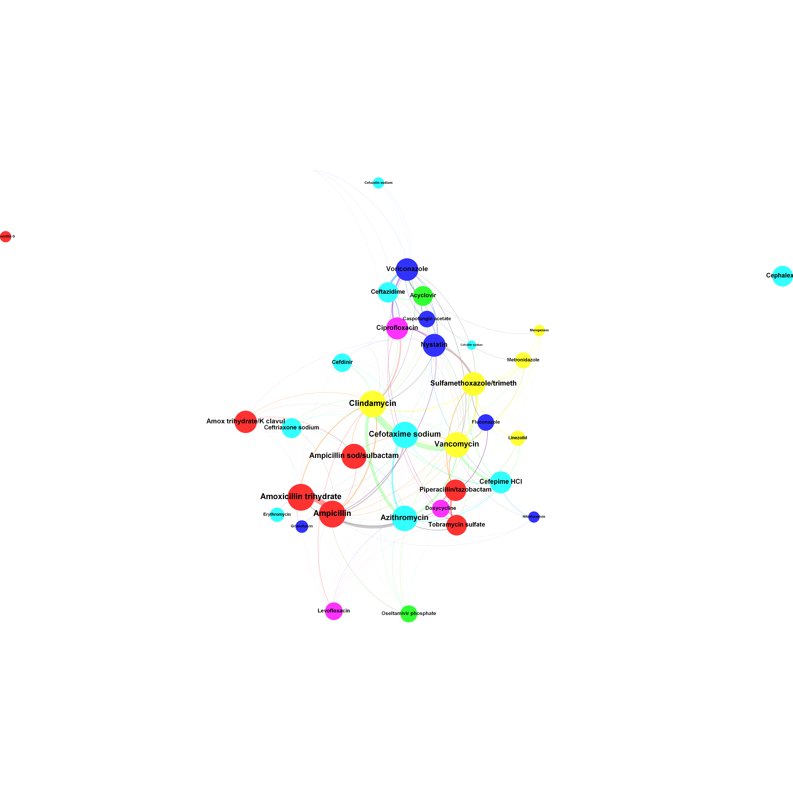

	
```{r setup, echo=FALSE, cache=FALSE,warning=FALSE,message=FALSE}
library(knitr)
library(rmdformats)
library(Wu)
opts_chunk$set(echo=TRUE
             , cache=FALSE
             , eval=TRUE
             , prompt=FALSE
             , results="asis"
             , tidy=FALSE
             , comment=NA
             , message=FALSE
             , warning=FALSE
             , out.width = '80%'
             , class.source='klippy'
               )
eval_fast <- TRUE
eval_slow <- FALSE
klippy::klippy(position = c('top', 'left')
             , tooltip_message = 'Click to copy'
             , tooltip_success = 'Done')
```


# [Back to Index](index.html)

# Visualize Network with Gephi 

 * Visualize Patterns of Antibiotic Combinations Using Social Network Analysis Software Gephi. 
 * Poster session presented at: The 8th Annual Mid-Atlantic Healthcare Informatics Symposium. 2015 Oct 23. Philadelphia, PA.




