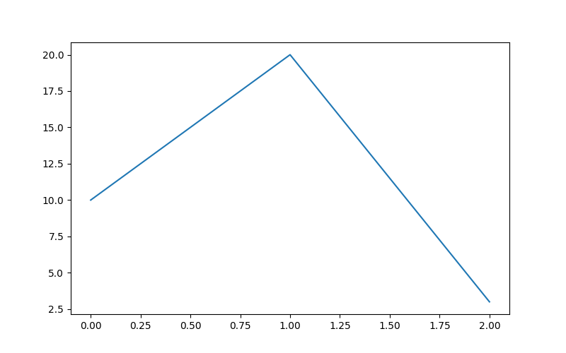

# [Index](index.html)


# General rmarkdown Setting

```{r setup, echo = FALSE, cache = FALSE, warning = FALSE, message = FALSE}
library(knitr)
library(rmdformats)
library(Wu)
opts_chunk$set(echo=TRUE,
               cache=FALSE,
               eval=TRUE,
               prompt=FALSE,
               results="asis",
               tidy=FALSE,
               comment=NA,
               message=FALSE,
               warning=FALSE,
               out.width = '80%')
eval_fast <- TRUE
eval_slow <- FALSE
```


# Knitr setting for rmarkdown export

 * library(reticulate)
 * py_config: see current python version
 * use_virtualenv("py39bert")
 * Enable knit_engine to use python for rmarkdown export purpose
 * knitr::knit_engines$set(python = reticulate::eng_python)
 
```{r}
library(reticulate)
py_home <- py_config()
use_virtualenv(py_home$virtualenv)
knitr::knit_engines$set(python = reticulate::eng_python)
```

# Install Python 3.9 on Ubuntu

 1. Check Ubuntu version
	````
    lsb_release -a
	````
 2. Update packages
	````
    sudo apt update
	sudo apt -y upgrade
	````
 3. Install python 3.9
    ````
	sudo apt install python3.9
	python3 -V
	python3.9 -V
	````
 4. Install pip
	````
    python3.9 -m pip install --upgrade pip
	````
 5. Install virtualenv
    ````
	pip3 install virtualenv
	which virtualenv
	````
 6. Create a virtualenv using Python 3.9 named as py39bert
    ````
	which python3.9
	virtualenv -p /usr/bin/python3.9 py39bert
	````
 7. Activate the virtualenv
    ````
	source ~/py39bert/bin/activate
	````
 8. Install ipython and jupyter notebook within virtualenv
    ````
	pip3 install ipython
	pip3 install jupyter notebook
    jupyter notebook to start jupyter notebook
	````
 9. Install python packages within the virtualenv
    ````
	pip3 install numpy
	````
 


# Install Python packages within R

 * Run python module within R

```{r}
library(reticulate)
py_home <- py_config()
use_virtualenv(py_home$virtualenv)
## virtualenv_install(py_home$virtualenv, "feather")

os <- import("os")
os$environ['HOME']
os$listdir()[1:2]
```


# Install Python packages within Python

```{python}

import subprocess

def install(package):
    subprocess.check_call([sys.executable, "-m", "pip", "install", package])

# install("matplotlib")

```


# Save Data in R

```{r}
library(feather)
library(data.table)
dt <- data.table(v1=1:6, v2=rep("A", 6))
write_feather(dt, "dt.feather")
list.files(pattern = "*.feather")

```


# Read feather in Python

```{python}
import os
print(os.getcwd())
path = os.getcwd()
os.chdir(path)
print(os.listdir())
print(os.getcwd())


import pandas as pd
# import feather
path = "dt.feather"


df = pd.read_feather(path)

print(df)

```


# reticulate

 * virtualenv_list() lists virtual environment
 * use_virtualenv("virtual-environment-name"): initiate python from virtual-environment, required = TRUE check if there is the version, otherwise may search for other versions
 * use_python("python path"): initiated python from path
 * py_config() to see version
 
 
 
```{r, eval = FALSE}


## library(reticulate)


## Sys.setenv(RETICULATE_PYTHON = "/home/gongw/.virtualenvs/pybert/bin/python3.9")
## Sys.setenv(LD_LIBRARY_PATH = paste(
##              "/home/gongw/.virtualenvs/pybert/lib"
##            , Sys.getenv("LD_LIBRARY_PATH")
##            , sep = ":"))
## use_python("/home/gongw/.virtualenvs/pybert/bin/python3.9")

library(reticulate)
## use_python("/home/gongw/.virtualenvs/py39bert/bin/python3.9")
## use_python("/usr/bin/python3")

use_virtualenv("py39bert")

py_config()
py_discover_config()
## py_install()


## reticulate::py_config()


virtualenv_list()
## reticulate::use_python("/usr/bin/python3")
## use_virtualenv("py39bert", required = TRUE)
## py_available()

## reticulate::use_python("~/venv/pybert/bin/python3")

os <- import("os")
os$listdir(".")
sys <- import("sys")
sys$version


## py_install("pandas")
#py_install("pandas", method = "auto", conda = "auto")

```

# python matplotlib

```{python}

import sys
print(sys.version)

import seaborn as sns
pr = sns.load_dataset("fmri")
import matplotlib as plt
sns.lmplot("timepoint", "signal", data = pr)
plt.pyplot.show()
```

# Python print


```{python}


x = 'hello, python world!'
print(x)

import numpy as np
a = np.arange(5)
print(a)


```


# Save Python plot

 * To show plot in rmarkdown
 
    ````
	
    
	
    ````

```{python}

import matplotlib.pyplot as plt
fig, ax = plt.subplots( nrows=1, ncols=1 )
ax.plot([0,1,2], [10,20,3])
#ax.show()
# plt.plot([1,2,3],[3,4,5])
# plt.show()

fig.savefig("pythton_pyplot.png")
plt.close(fig)
```


# Python Version

```{python}
import sys
print(sys.version_info)
```

# sessionInfo()

```{r}
sessionInfo()

```
